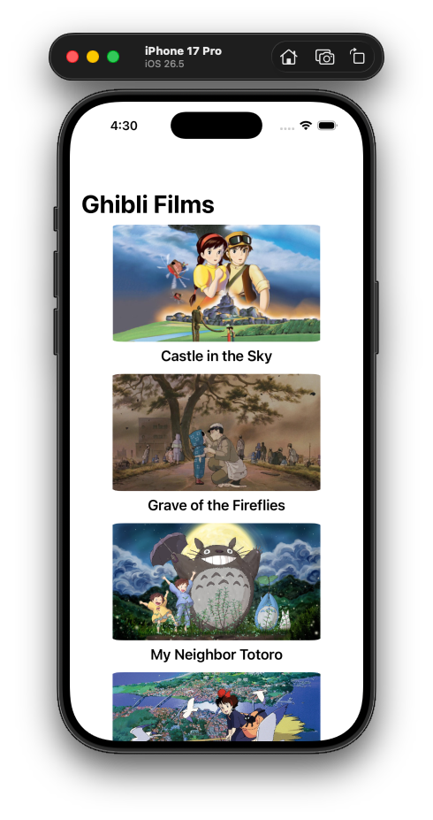
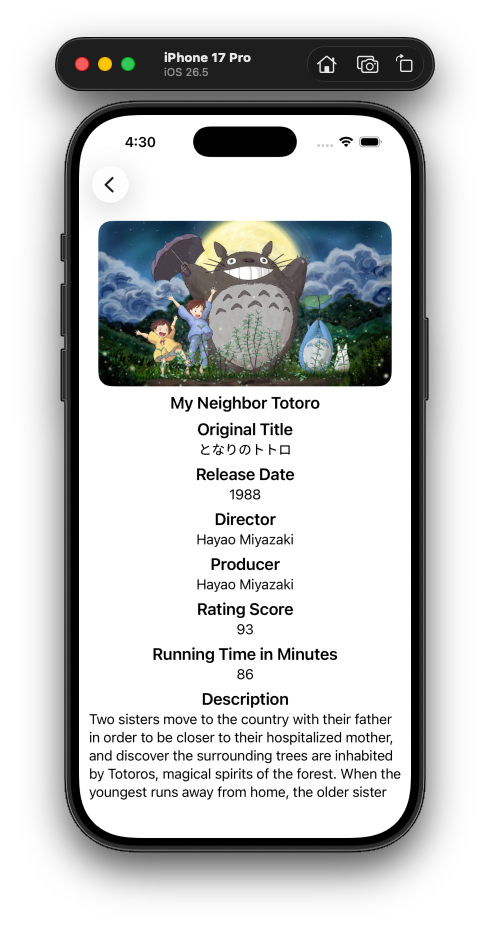

# 🎬 Ghibli Films Browser

A native iOS app built with **SwiftUI** that browses Studio Ghibli films using the [Ghibli API](https://ghibliapi.vercel.app). Features a film list with banner images and a detail screen with full film metadata.

## 📱 Screenshots

| Film List | Film Detail |
|:---------:|:-----------:|
|  |  |

## 🚀 About This Project

Ghibli Films Browser lets users explore the complete Studio Ghibli film catalog. The app fetches film data from the Ghibli REST API and presents it in a clean, navigable SwiftUI interface:

- **Film List Screen** — scrollable grid of films with movie banners and titles, loaded asynchronously
- **Film Detail Screen** — displays original title, release date, director, producer, rating score, running time, and plot description
- **Loading & Error States** — progress indicator while fetching, error message on failure
- **Navigation** — push-based navigation via `NavigationStack` with `NavigationLink`

## 📚 Libraries Used

| Library | Version | Purpose |
|---------|:-------:|---------|
| [Alamofire](https://github.com/Alamofire/Alamofire) | 5.12.0 | HTTP networking with response caching and validation |

## 🌐 API Used

**Ghibli API** — `https://ghibliapi.vercel.app`

| Endpoint | Method | Description |
|----------|:------:|-------------|
| `/films` | GET | Returns all Studio Ghibli films as a JSON array |

Example response field mapping to the `Film` model:

```
id, title, original_title, original_title_romanised, image,
movie_banner, description, director, producer,
release_date, running_time, rt_score, url
```

## 📁 Folder Structure

```
TestApp/
├── pages/
│   ├── TestAppApp.swift       # @main app entry point
│   ├── ContentView.swift      # Film list screen with async loading
│   ├── DetailView.swift       # Film detail screen
│   └── DetailScreen.swift     # Alternate entry point (unused in production)
├── components/
│   └── TitleDesc.swift        # Reusable title + description row
├── mock/
│   └── GhibliFilm.swift       # Mock film data for SwiftUI previews
├── services/
│   └── GhibliServices.swift   # Film model + API service (Alamofire)
└── Assets.xcassets/           # App icons and accent colors
```

## 🛠 Requirements

- iOS 16.0+
- Xcode 15.0+
- Swift 6.0

## ▶️ Running the Project

1. Clone the repository
2. Open `TestApp.xcodeproj` in Xcode
3. Wait for Swift Package Manager to resolve Alamofire
4. Select an iOS simulator or device
5. Press **Run** (⌘R)

## 👤 Author

**Hamam Nasrodin** — 2026
